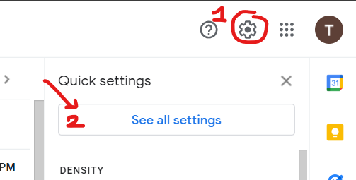
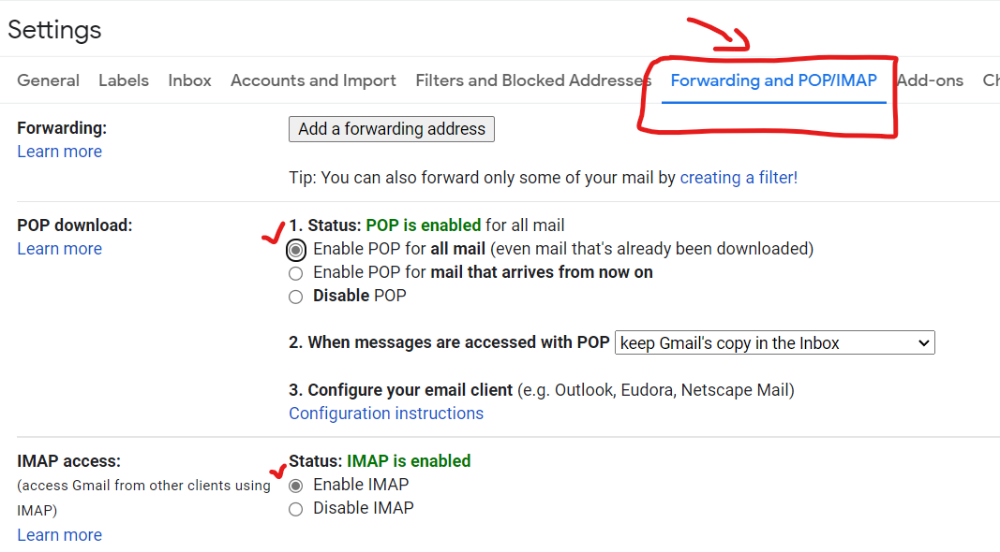
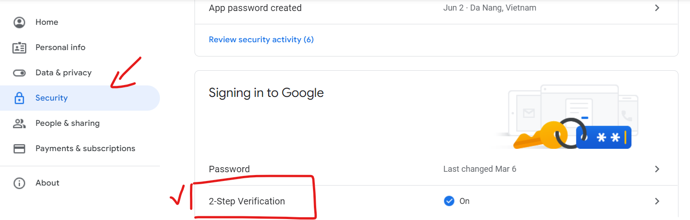
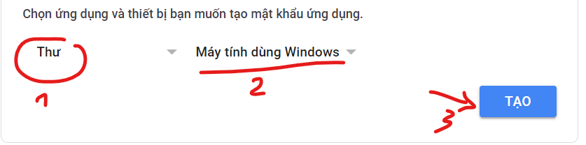
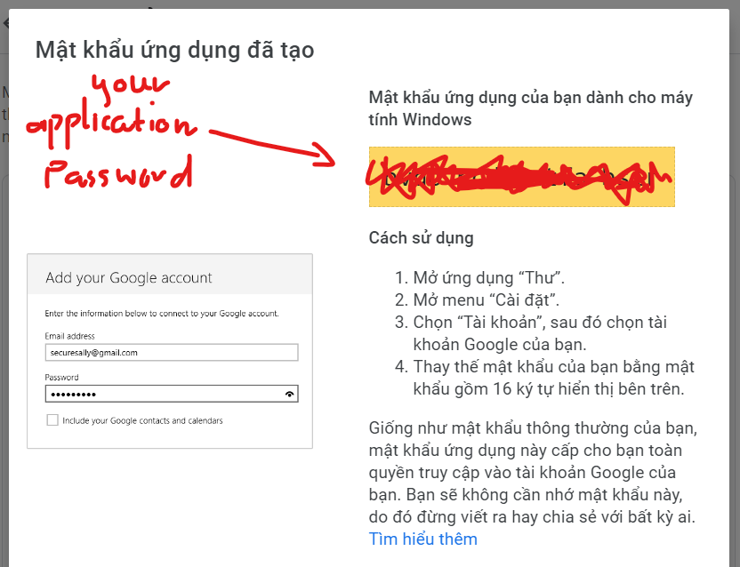

# Just do it
## Make sure that u have already installed composer, or download it here https://getcomposer.org/
  ## Step1: Open phpmyadmin to create a new database for project: (example: pbl5 (utf8mb4_general_ci)) 
  ## Step2: Go to htdocs folder then open git Bash here
   ### - Run command: git clone <this project>
   ### - Run command: cd "project folder"
   ### - Run command: composer install
   ### - Run command: cp .env.example .env
   ### Open: .env -> edit: DB_DATABASE (exp: DB_DATABASE=pbl5)
   ### - Run command: php artisan key:generate
   ### - Run command: php artisan migrate
   ### - Run command: php artisan storage:link
  ## Step3: Run command: php artisan serve -> http://127.0.0.1:8000/home
    
# (option1) After pull, plz run command: 'php artisan migrate' to create the database
    
# (option2) To create the database with seeder (demo data) : php artisan migrate:refresh --seed  
available admin: admin@gmail.com, password: 123 (route: /admin/login): go to 'roles' and 'permissions' feature in 'admin page' to add more permissions for admin 

# Setup to use 'Email Verification'
Notice that: Now, Google has decided to begin phasing out Less Secure Apps from May 30th, 2022. Google Workspace and Google Cloud Identity users won’t be affected right away, but support for Less Secure Apps will still be phased out for those users at a later date.

We’ve recommended app passwords for some time, but some customers have chosen to use Less Secure Apps since it’s a little more straightforward. Now that the feature is being retired, all users will need to switch to app passwords or use a different mailer.
## Step1: setting your gmail account

### Enable 2 steps verification

### Click: App password (under 2 steps verification)

### Copy generated App password 

## Step2: config .env
    APP_NAME={your_app_name}
    ...

    MAIL_MAILER=smtp
    MAIL_HOST=smtp.gmail.com
    MAIL_PORT=587
    MAIL_USERNAME={your_gmail}
    MAIL_PASSWORD={your_app_password}
    MAIL_ENCRYPTION=tls
    MAIL_FROM_ADDRESS={your_gmail}

